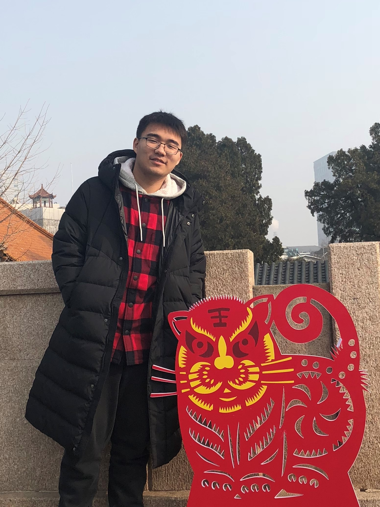

# Chi Zhang
## About Me

Hi, my name is Chi Zhang. I’m a second-year Master's student at the University of California San Diego. My Bachelor's degree was at the University of Illinois Urbana Champaign study in Electrical Engineering. My research interests mainly lie in the intersection between control, ML, and energy systems. 

 

## Research
### Gym-Based Simulator for Energy Systems Modeling And Reinforcement Learning Algorithm Design
The recent progress in reinforcement learning has made it possible to design controllers to make planning and operational decisions for highly complex power systems. However, it has been a challenging problem to quantify advancements in energy systems study due to the need for a commonly deployed simulation environment. In our research, we have been constructing a set of foundational platforms and computational tools for researchers to directly design and implement their RL and control paradigms on three benchmarking tasks of distribution grid voltage regulation, primary frequency control, and building HVAC system operations.

    

*Related work*:
Zhang, C., Shi, Y., & Chen, Y. (2022). BEAR: Physics-Principled Building Environment for Control and Reinforcement Learning. arXiv. https://doi.org/10.48550/arXiv.2211.14744

## Else
### Fun Project
I built this IOT self-clean cat litter box with my friend to solve his "cat cleaning issue". The prototype achieved all our goals, but the cat chose not to jump in the box. The advanced future technology is too early for this cat.

    

### BiliBili Self-Media
My secrect.

    

